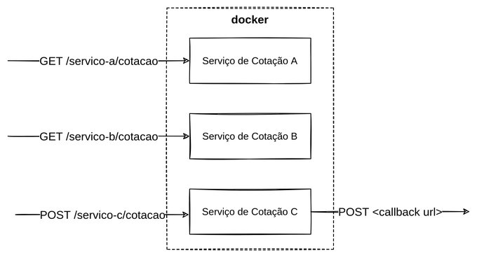

## Hexchange API 💵 💵 💵

Example of API using three upstream services to aggregate data. One of them uses a webhook callback to return its results.

Based on [Francisco Zanfranceschi](https://twitter.com/zanfranceschi) tweet challenge.

### Challenge:

- Aggregate data from three [upstream](https://medium.com/code-factory-berlin/up-down-stream-what-is-it-a4b4792f5d0b) APIs into one API.
- Upstream Service C uses a webhook callback to return its results.

### Diagram:



### Getting Started:

**Requirements:**

- Node.js 14.x or above
- Docker 20.x or above
- pnpm 7.x or npm 7.x

Francisco shared a Docker Hub image with all three services.

Open your terminal and in one window execute:

```bash
docker run --rm -p 8080:80 zanfranceschi/desafio-01-cotacoes
```

Open another terminal window and execute:

```bash
git clone git@github.com:oieduardorabelo/hexchange.git
cd hexchange
pnpm install # or npm install
pnpm dev # or npm run dev
```

With the environment ready, you can start querying the Hexchange API

```bash
curl http://localhost:4000/cotacoes/usd
curl http://localhost:4000/cotacoes/eur
```
